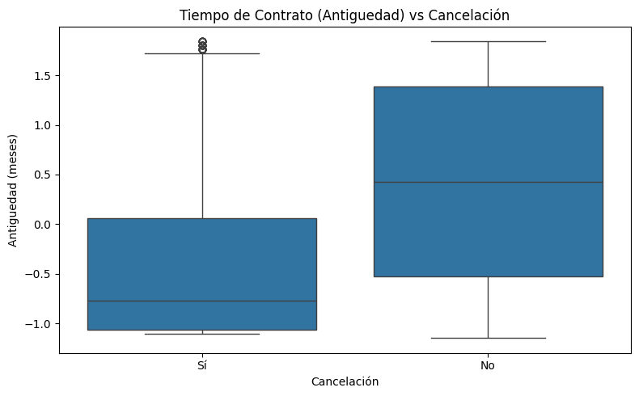
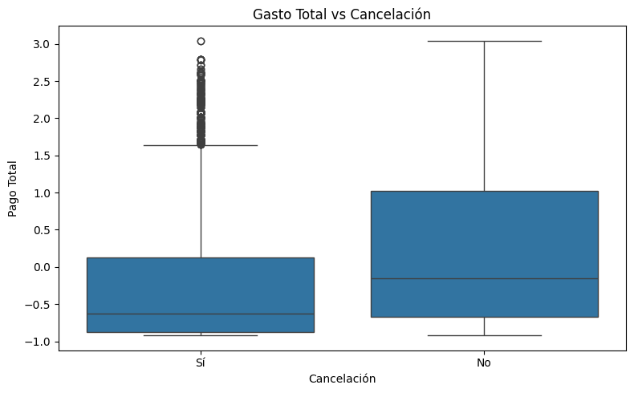
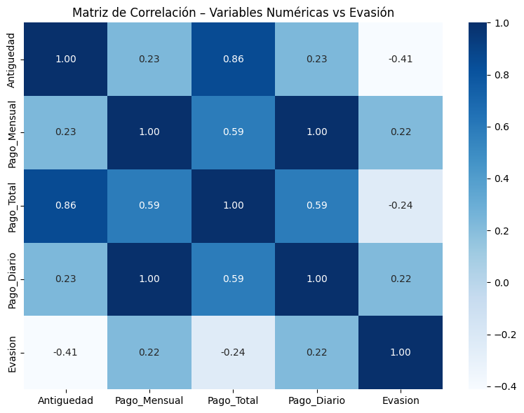
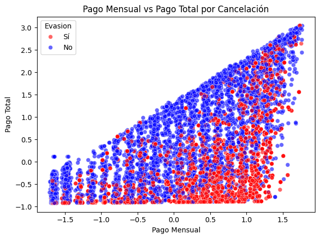

<p align="center">
  
</p>


# 📊 Telecom X – Predicción de Churn (Parte 2)

Proyecto desarrollado dentro del **desafío Telecom X** del programa **ONE Oracle Next Education**.  
Este proyecto se enfoca en la **construcción de modelos predictivos** para anticipar la cancelación de clientes (churn), utilizando técnicas de **machine learning**, preparación de datos, análisis de correlación y evaluación de modelos.

---

## 🧾 Índice

- [📌 Estado del proyecto](#-estado-del-proyecto)
- [🎯 Propósito del análisis](#-propósito-del-análisis)
- [🗂 Estructura del proyecto](#-estructura-del-proyecto)
- [🛠️ Preparación de los datos](#preparacion-de-los-datos)
- [📊 Ejemplos gráficos e insights](#-ejemplos-gráficos-e-insights)
- [🤖 Modelado predictivo](#-modelado-predictivo)
- [📈 Evaluación de modelos](#-evaluación-de-modelos)
- [🧠 Interpretación de variables](#-interpretación-de-variables)
- [🚀 Instrucciones para ejecutar](#-instrucciones-para-ejecutar)
- [📝 Conclusiones finales](#-conclusiones-finales)
- [👩‍💻 Autoría](#autoria)

---

## 📌 Estado del proyecto
✅ Proyecto finalizado  
Incluye preparación de datos, análisis exploratorio, entrenamiento de modelos y evaluación de métricas.

---

## 🎯 Propósito del análisis

El objetivo principal es **predecir la cancelación de clientes (churn)** a partir de variables relevantes del negocio.

Se busca:

- Construir modelos predictivos de clasificación  
- Comparar modelos con y sin normalización  
- Evaluar el rendimiento con métricas adecuadas  
- Identificar las variables más importantes en la predicción  
- Apoyar la toma de decisiones estratégicas para reducir la pérdida de clientes  

📌 Este proyecto simula el rol de una científica de datos en un entorno real de negocio, aplicando **preprocesamiento**, **modelado** y **evaluación de modelos de machine learning**.

---

## 🗂 Estructura del proyecto

```text
telecom-x-churn-parte-2/
│
├── data/
│   └── datos_tratados.csv          # Datos limpios provenientes de la Parte 1
│
├── images/                         # Gráficos del EDA y correlaciones
│   ├── correlacion_numericas.png
│   ├── boxplot_antiguedad_churn.png
│   ├── boxplot_gasto_churn.png
│   └── matriz_confusion.png
│
├── notebooks/
│   └── TelecomX_Parte2.ipynb        # Notebook principal con EDA y modelos
│
├── LICENSE                         # Licencia MIT del proyecto
└── README.md                       # Documentación del proyecto
```

---

## 🛠️ Preparación de los datos

El flujo de preparación de datos incluye:

- Carga del archivo CSV con los datos tratados de la Parte 1  
- Eliminación de columnas irrelevantes (por ejemplo, IDs)  
- Separación de variables categóricas y numéricas  
- Encoding de variables categóricas mediante one-hot encoding  
- Verificación de la proporción de churn para analizar desbalance de clases  
- Aplicación de técnicas de balanceo solo sobre el conjunto de entrenamiento para evitar data leakage  
- Normalización / estandarización de variables para modelos sensibles a la escala  

📌 Nota: El balanceo de clases se muestra a nivel exploratorio, pero para entrenar los modelos se aplica únicamente sobre el conjunto de entrenamiento.

---

## 📊 Ejemplos gráficos e insights

Se incluyen visualizaciones clave obtenidas durante el análisis exploratorio de datos (EDA) para identificar patrones y tendencias.

✔ **Antigüedad vs Churn**  
Clientes con menor tiempo en la empresa presentan mayor probabilidad de cancelar el servicio.  


✔ **Gasto total vs Churn**  
El análisis de gasto total muestra diferencias entre clientes que permanecen y los que cancelan.  


✔ **Correlación entre variables numéricas**  
Se observa la relación entre variables numéricas y su impacto en la predicción de churn.  


✔ **Matriz de confusión del modelo**  
Evaluación de desempeño del modelo seleccionado.  


---

## 🤖 Modelado predictivo

Se divide el dataset en conjuntos de entrenamiento y prueba (train/test split).

Se entrenan al menos dos modelos:

- Un modelo que requiere normalización (por ejemplo, Regresión Logística o KNN)  
- Un modelo que no requiere normalización (por ejemplo, Árbol de Decisión o Random Forest)  

📌 Justificación:

Modelos basados en distancia u optimización (Regresión Logística, KNN, SVM) son sensibles a la escala de los datos, por lo que la normalización es necesaria.

Modelos basados en árboles no dependen de la escala de las variables.

---

## 📈 Evaluación de modelos

Cada modelo se evalúa utilizando:

- Exactitud (Accuracy)  
- Precisión (Precision)  
- Recall  
- F1-score  
- Matriz de confusión  

Luego se comparan los resultados para analizar:

- Qué modelo presenta mejor desempeño  
- Posibles casos de overfitting o underfitting  
- Ajustes potenciales para mejorar los resultados  

---

## 🧠 Interpretación de variables

Según el modelo utilizado, se analiza la importancia de las variables:

- En modelos lineales: coeficientes de las variables  
- En Random Forest: importancia de variables basada en la reducción de impureza  
- En otros modelos: métricas o pesos relevantes para entender la contribución de cada variable  

El objetivo es identificar qué factores influyen más en la cancelación de clientes.

---

## 🚀 Instrucciones para ejecutar

### 1️⃣ Clonar el repositorio

```git clone https://github.com/belubullorini/telecom-x-churn-parte-2.git```

### 2️⃣ Instalar dependencias

```pip install pandas numpy matplotlib scikit-learn```

### 3️⃣ Ejecutar el notebook

Podés ejecutarlo en Jupyter Notebook o Google Colab:

- Cargar el archivo datos_tratados.csv  
- Ejecutar las celdas de preparación de datos  
- Realizar el EDA y análisis de correlación  
- Entrenar los modelos  
- Evaluar métricas y comparar resultados  
- Analizar la importancia de variables y conclusiones  

---

## 📝 Conclusiones finales

- Se identifican las variables más influyentes en la cancelación de clientes  
- Se comparan modelos con y sin normalización  
- Se selecciona el modelo con mejor desempeño según métricas  
- Se proponen posibles estrategias de retención basadas en los resultados obtenidos  

---

## 👩‍💻 Autoría

Proyecto realizado por **M. Belén Bullorini**, en el marco del programa  
ONE Oracle Next Education.

🔗 LinkedIn: https://www.linkedin.com/in/belenbullorini  
🔗 GitHub: https://github.com/belubullorini
